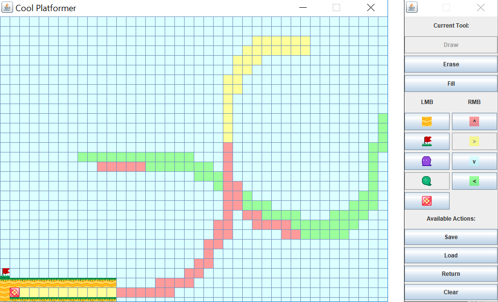

# cool-platformer
A platformer made as a collaboration between Patrick Au and James Long as their culminating project for the course ICS4U.

## Premise
You are a block trying to get to a flag. Along the way, there will be spooky ghosts and blobs that try and chase you down. Do your best to navigate the platforms and changing gravity fields in order to reach your goal!

## Instructions
Use the arrow keys to move your block around, and hit "P" in the middle of a stage to pause the game. Avoid enemies, and get to the flag. Gravity fields, shown by differently coloured tints, will alter the direction of gravity within the field. There are more instructions in-game, so do your best!

# Screenshots

## Miscellaneous
Concept Art:
http://imgur.com/7SpJEaQ

Keybinding Tutorial used (preferred over KeyListener):
http://www.dreamincode.net/forums/topic/245148-java-key-binding-tutorial-and-demo-program/
